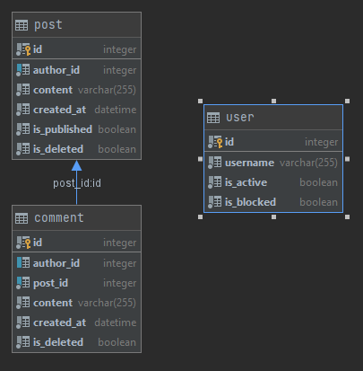

# LPDIM_blog_symphony

###Questions du TP

####1 Quelles sont les fonctionnalités principales du Symfony CLI ?
    faciliter la vie des dev et la création et la générationd de code (en vrai c'est le bro)
####2 Quelles relations existent entre les entités (Many To One/Many To Many/...) ? Faire un schéma de la base de données.

Entre comment et post c'est un ManyToOne ( plusieurs commentaire par poste)
Entre comment et user c'est un ManyToOne ( plusieurs comment  par user)
Entre user et post c'est un ManyToOne ( plusieurs posts par user)

####3 Expliquer ce qu'est le fichier .env 
En gros c'est la ou tu stocke les données genre mots de passe clé api , et autres trucs du genre

####4 Expliquer pourquoi il faut changer le connecteur à la base de données
il faut changer le connecteur car on veux utiliser sqlite et pas postgre qui est activé de base.

####5 Expliquer l'intérêt des migrations d'une base de données
l'intéret des migrations est de pouvoir travailler sur sa base de données en mode ""offline"" et de push ses modifs une fois fini

####6 Faire une recherche sur les différentes solutions disponibles pour l'administration dans Symfony
Il existe plsieurs bundle d'amin 
Sonata : complexe 
EasyAdmin : plus simple à utiliser 

####7 Travail préparatoire : Qu'est-ce que EasyAdmin ?
Easyadmin permet de créer facilement un module d'administration backend, il permet d'ajouter des dashboards , des cruds , et tout le reste dont on à besoin pour les architecture.

####8 Pourquoi doit-on implémenter des méthodes to string dans nos entités?
Pourquoi doit-on implémenter des méthodes to string dans nos entités?

####9 Pourquoi doit-on implémenter des méthodes to string dans nos entités?
pour que les paramêtres soient affichables de la bonne façon pour les utilisateurs 
par exemple dans les ddl des autres crudcontroller

####10 Qu'est-ce que le ParamConverter ? À quoi sert le Doctrine Param Converter ?

Le param converter permet de faire en sprte qu'un objet soit généré à partir des arguments d'une fonction grace à cette annotation

